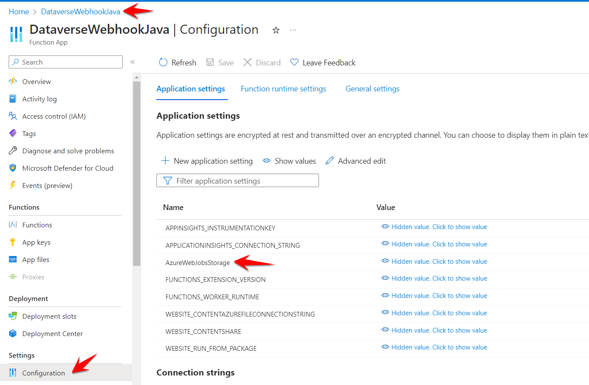
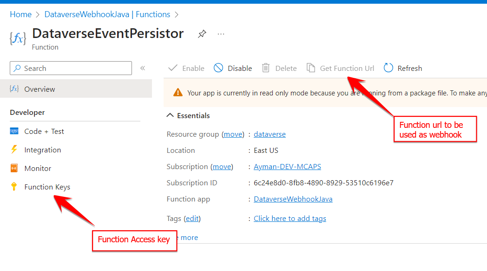
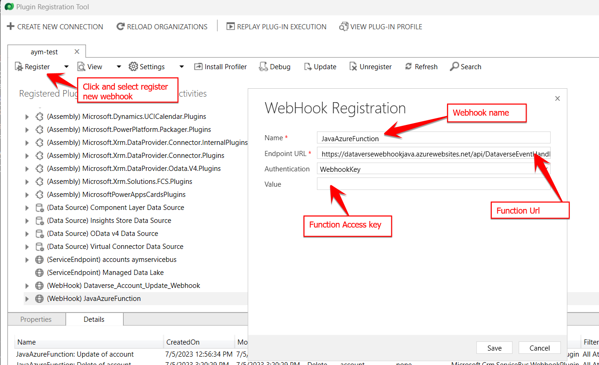
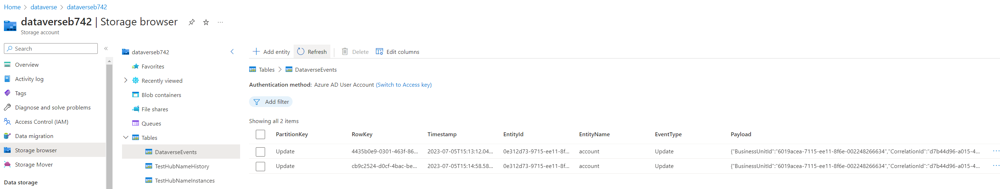

# Dataverse events capturing using Webhook

This repository demonstrate how to capture Events from Dataverse world using power platform Webhook plugin and Azure functions (as webhook implementation) to save events data to Azure storage Table.

## Prerequisites

- [Azure function tools](https://learn.microsoft.com/en-us/azure/azure-functions/functions-run-local?tabs=windows%2Cportal%2Cv2%2Cbash&pivots=programming-language-csharp)
- [Java JDK 17+](https://openjdk.org/install/)

`**Note:** In the case of using the dev-container and VSCode, all dependencies are already installed.`

## Get Started

### Test locally

- Clone this repository: `git clone https://github.com/CSE-Neutrino/dataverse-webhook-sample.git`.
- Open the folder using VSCode
- Add your local settings file [`local.settings.json`](local.settings.json)

- Update Azure storage connection string `AzureWebJobsStorage` config to valid connection `note: storage emulator can't be used inside dev-container`
- Press `F5` to start Azure function host
- From `Azure extension tab on the extensions left bar`, right click on  `Workspace> Local Project>  Functions> DataverseEventHandler` and click `Execute Function Now` then file request body

### Test on Dataverse and Azure environment

- Create new Azure function App with Java as runtime

- Deploy function to the newly created function App

- Update storage account connection string Configuration > `AzureWebJobsStorage`

- Get `function url` and `Access Key` from Azure portal

- Register new webhook to Microsoft dynamics environment using [Plugin registration tool](https://learn.microsoft.com/en-us/power-apps/developer/data-platform/download-tools-nuget#download-and-launch-tools-using-power-platform-cli)

- Create new Step to handle specific event (update) for dataverse entity (account)

- Update dataverse table record using [Power platform make portal](https://make.preview.powerapps.com/)

- Check data has been created using data explorer on Storage Account > Tables > DataverseEvents
